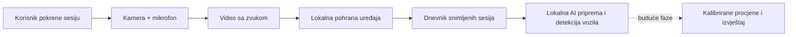
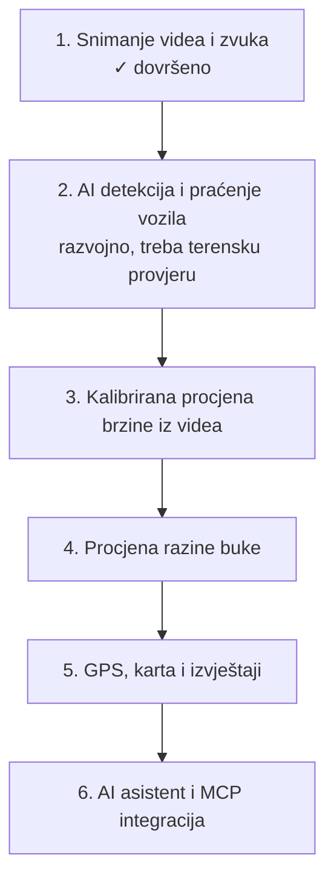
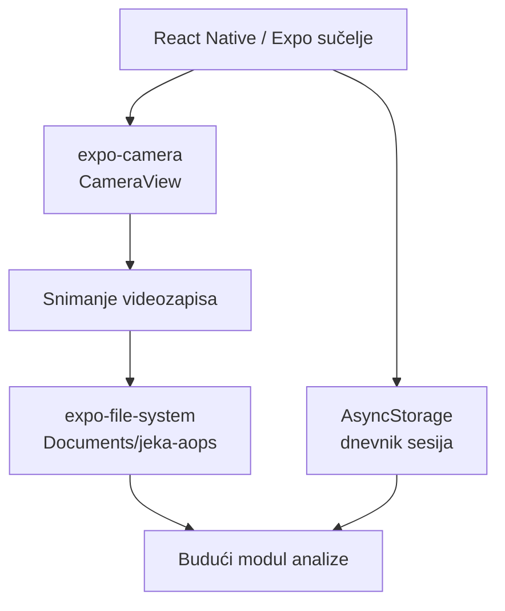

# JEKA AOPS

**JEKA AOPS — Audio-optički sustav prometne sigurnosti**

Mobilni istraživačko-razvojni projekt za snimanje i kasniju analizu prometnih scena pomoću kamere, mikrofona i umjetne inteligencije na pametnom telefonu.

> Trenutačna verzija: **v0.2.0 razvojna**. Aplikacija lokalno snima videosesije sa zvukom i priprema dokazne kadrove za eksperimentalnu analizu. Javni izvor ne distribuira AI model. Aplikacija ne mjeri niti potvrđuje stvarnu brzinu vozila ili razinu buke.

## Cilj

JEKA AOPS služi za razvoj alata koji će pomoći pri promatranju prometnih uvjeta. Buduće verzije predviđaju praćenje vozila, procjenu brzine, procjenu razine buke te izvještaje povezane s lokacijom.

## Kako radi



## Faze razvoja



## Trenutačne mogućnosti

- Snimanje videozapisa sa zvukom kroz stražnju ili prednju kameru.
- Dozvole za kameru i mikrofon na Androidu i iOS-u.
- Trajna lokalna pohrana snimljene datoteke na uređaju.
- Uvoz MP4, MOV, M4V i 3GP snimki do 500 MB uz provjeru trajanja.
- Lokalni dnevnik sesija s vremenom snimanja, trajanjem i veličinom datoteke.
- Pregled snimljenog videa unutar aplikacije i trajno brisanje odabrane sesije.
- Sučelje prilagođeno radu na terenu: status, mjerač vremena i brzo zaustavljanje snimanja.
- Eksperimentalna lokalna obrada: izdvajanje i rangiranje kadrova, osnovno praćenje, OCR kandidati oznaka i korelacija audio uzoraka. Detektor vozila zahtijeva zaseban pravilno licenciran model.
- Razvojna dijagnostika prikazuje confidence, vrijeme i okvir svake detekcije po tragu vozila.
- Automatizirane provjere obuhvaćaju lint, TypeScript i testove čistih analitičkih modula.

## Arhitektura prototipa



## Pokretanje lokalno

### Preduvjeti

- Node.js LTS
- Expo development build na Android ili iOS telefonu
- Računalo i telefon na istoj Wi-Fi mreži

### Instalacija i pokretanje

```bash
npm install
npm start
```

Pokrenite razvojni poslužitelj i otvorite ga development buildom. Za rad kamere koristite stvarni uređaj; emulator nije prikladan za terensko snimanje.

## Android development build i terensko testiranje

Za lokalni AI model aplikacija će koristiti vlastiti Android development build, a ne Expo Go. Konfiguracija je pripremljena u `eas.json` pod profilom `development` i proizvodi interni `.apk` paket.

Nakon prijave u Expo račun, build se stvara naredbom:

```bash
npx eas-cli@latest build --platform android --profile development
```

Nakon instalacije tog paketa na telefon, razvojni poslužitelj pokreće se s:

```bash
npx expo start --dev-client
```

Prije početka snimanja potvrdite dozvole za kameru, mikrofon i lokaciju. Snimite kratke scene u različitim uvjetima (jedno vozilo, više vozila, dan/noć), otvorite pojedinu sesiju i provjerite jesu li detekcije smisleno vezane uz dokazne kadrove. Rezultate detekcije, OCR-a i buke tretirajte kao eksperimentalne dok se ne potvrde kroz terenska testiranja.

## Privatnost i sigurnosna napomena

- Snimke se u ovoj fazi čuvaju lokalno na uređaju.
- Lokacija je zadano isključena; kad je korisnik uključi, sprema se samo približna lokacija.
- Korisnik je odgovoran za zakonito korištenje kamere i mikrofona te poštovanje privatnosti drugih osoba.
- Rezultati budućih modula bit će procjene, a ne certificirana mjerenja ili dokaz o prometnom prekršaju.
- Aplikacija ne smije ometati vozača. Snimanje treba obavljati samo sigurno i u skladu s prometnim propisima.

## Tehnologije

- Expo SDK 54
- React Native 0.81.5
- TypeScript
- `expo-camera`
- `expo-file-system`
- `expo-video`
- AsyncStorage

## AI model

Javni repozitorij ne uključuje binarni AI model. Zašto je prethodni razvojni artefakt uklonjen i koji su uvjeti za doprinos novog modela opisano je u [modelskoj kartici](docs/MODEL.md).

## Smjer projekta

JEKA AOPS je otvoreni istraživačko-razvojni projekt pod licencom Apache-2.0. Sljedeći korak je integracija provjerljivo licenciranog lokalnog modela i terenska provjera u Android development buildu. Bez kalibracije scene rezultati se ne smiju predstavljati kao mjerenje.

## Doprinos i sigurnost

Pravila doprinosa opisana su u [CONTRIBUTING.md](CONTRIBUTING.md), odgovorna obrada podataka u [PRIVACY.md](PRIVACY.md), a privatna prijava ranjivosti u [SECURITY.md](SECURITY.md). Ne prilažite stvarne prometne snimke, GPS podatke ni osobne podatke u issue ili pull request.

## Licenca

Izvorni kod distribuira se pod licencom [Apache-2.0](LICENSE). Naziv i vizualni identitet projekta nisu automatski licencirani kao zaštitni znakovi. Ovisnosti i budući modeli ostaju pod vlastitim licencama.
